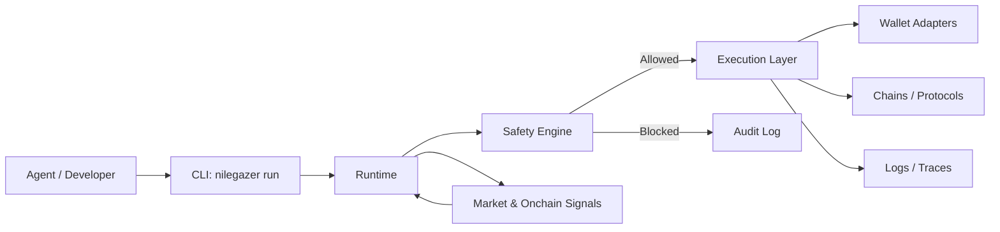

# NileGazer

[](https://github.com/NileGazer00/nilegazer/actions)
[](LICENSE)
[](https://NileGazer00.github.io/nilegazer)
[](https://github.com/NileGazer00/nilegazer/releases)
[](SECURITY.md)

> Policy-first autonomous finance and onchain execution for AI agents.

NileGazer is a premium open-source platform for building agents that can plan, verify, and execute real financial actions with safety, observability, and modular multi-chain support.

## Why NileGazer

Agents need more than tools. They need a runtime that can safely move value, enforce policy, and leave a full audit trail.

## What it does

- Plans agent workflows.
- Applies policy checks before execution.
- Executes swaps, transfers, approvals, and wallet actions.
- Tracks activity with logs and audit trails.
- Supports a modular architecture for chains, wallets, and signals.

## Quick start

```bash
pnpm install
pnpm build
pnpm --filter @nilegazer/cli dev
```

## Example

```bash
nilegazer run
```

## How it works



## Architecture

- `packages/core` — shared types and execution interfaces.
- `packages/runtime` — workflow orchestration and policy-aware execution.
- `packages/safety` — allowlists, validation, and policy checks.
- `packages/signals` — market data and external signals.
- `packages/wallets` — wallet integrations.
- `packages/observability` — logs, traces, and audits.
- `apps/cli` — command-line interface.
- `apps/examples` — sample workflows.

## Security model

NileGazer is designed with safety-first execution in mind.

- Policy checks run before execution.
- Actions can be blocked before value moves.
- Sensitive issues should be reported privately.
- The repo is intended to support audit-friendly output and traceable workflows.

See `SECURITY.md` for reporting guidance.

## Contributing

We welcome contributions that improve safety, reliability, docs, examples, and integrations.

Start with:
- `CONTRIBUTING.md`
- `.github/ISSUE_TEMPLATE/`
- `roadmap.md`

Look for `good first issue` and `help wanted` labels when available.

## Roadmap

- `nilegazer run` command.
- Sample workflow execution.
- Policy simulation mode.
- Better logs and audit output.
- Wallet adapters.
- Multi-chain integrations.
- Signals and market data.
- Contributor-friendly examples.

## Release notes

See `CHANGELOG.md`.

## License

MIT
